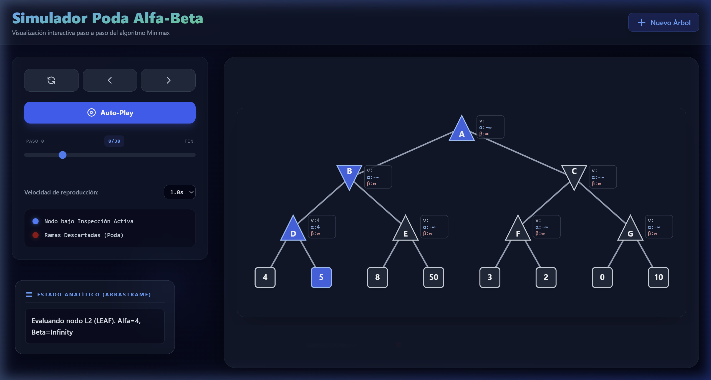

# Simulador Minimax con Poda Alfa-Beta 🤖🌳

Una herramienta educativa e interactiva diseñada para visualizar paso a paso el funcionamiento del algoritmo **Poda Alfa-Beta** en árboles de decisión para juegos de suma cero.



## ✨ Características Principales

- **Visualización en tiempo real**: Observa el recorrido del algoritmo (DFS), la actualización de valores y los límites **Alfa (α)** y **Beta (β)**.
- **Constructor visual (No-Code)**: Crea tus propios árboles de estudio sin tocar código, añadiendo nodos MAX/MIN y hojas con un clic.
- **Editor JSON avanzado**: Para usuarios que prefieren definir estructuras complejas rápidamente mediante arreglos anidados.
- **Lógica de poda realista**: Las ramas descartadas se marcan visualmente en rojo siguiendo las reglas matemáticas estrictas.
- **Panel narrativo**: Explicación detallada de cada decisión tomada por el algoritmo en cada paso.
- **Panel arrastrable (Drag & Drop)**: Reposiciona la explicación de estado en cualquier lugar de la pantalla.
- **Controles de reproducción**: Pausa, ajusta la velocidad y navega manualmente por la línea de tiempo de la simulación.

## 🚀 Tecnologías Utilizadas

- **React 19** + **TypeScript**: Para una lógica de componentes robusta y tipada.
- **Vite**: Motor de desarrollo ultra-rápido.
- **Tailwind CSS 4**: Estilización moderna con estética "Glassmorphism" y modo oscuro.
- **SVG Dinámico**: Motor de renderizado personalizado para el trazado de árboles sin solapamiento (Bounding Box logic).

## 🛠️ Instalación y Uso Local

1. **Clonar el repositorio**:
   ```bash
   git clone <url-del-repo>
   cd alfa_beta_ai_sim_ag
   ```

2. **Instalar dependencias**:
   ```bash
   npm install
   ```

3. **Ejecutar en modo desarrollo**:
   ```bash
   npm run dev
   ```
   Abre [http://localhost:5173](http://localhost:5173) en tu navegador.

## 🧠 Contexto para Agentes IA (AI System Context)

Este repositorio contiene un simulador pedagógico donde la jerarquía de archivos es:
- `/src/core/tree.ts`: Define el `TreeNode` y los parsers (JSON -> Tree).
- `/src/core/simulator.ts`: Contiene la implementación del algoritmo Alfa-Beta que genera el historial de pasos (`SimulationStep[]`).
- `/src/components/TreeVisualizer.ts`: Motor de renderizado que calcula posiciones `x, y` dinámicas para evitar colisiones de ramas.
- `/src/components/VisualTreeBuilder.tsx`: Interfaz No-Code para la creación manual de árboles.

**Reglas de diseño**: 
- Los nodos MAX son triángulos apuntando hacia arriba (Azul).
- Los nodos MIN son triángulos apuntando hacia abajo (Esmeralda).
- Las ramas podadas deben renderizarse en rojo (`#991b1b`).

## 📄 Licencia
Este proyecto es de uso educativo y libre.

---
**Desarrollado por José Alejandro Franco Calderon con el ❤️ para los estudiantes de Inteligencia Artificial.**